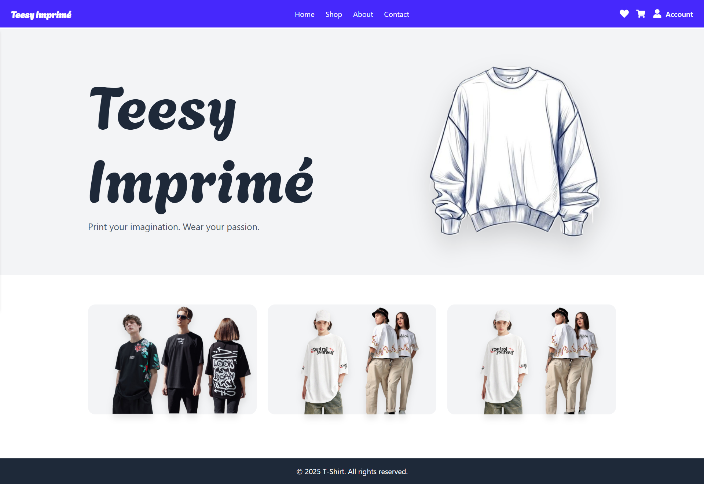
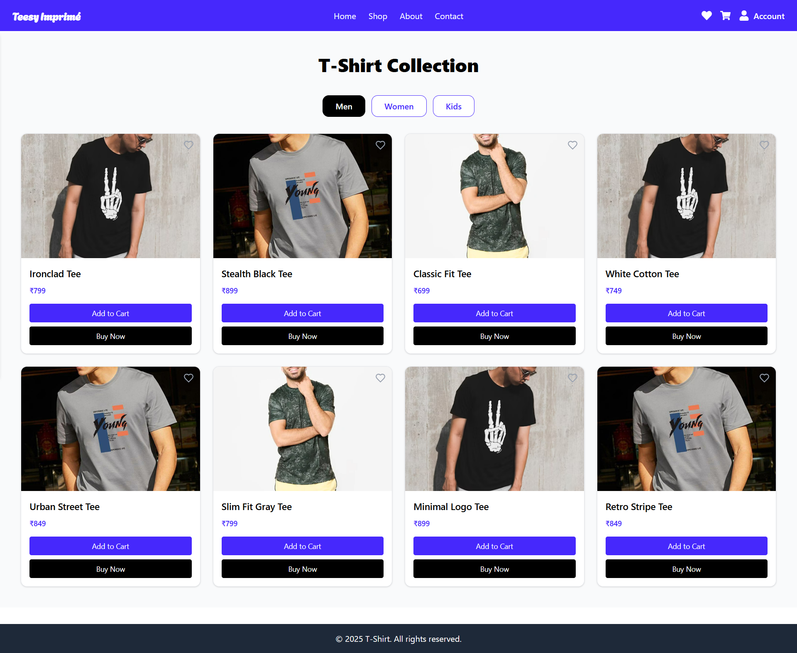
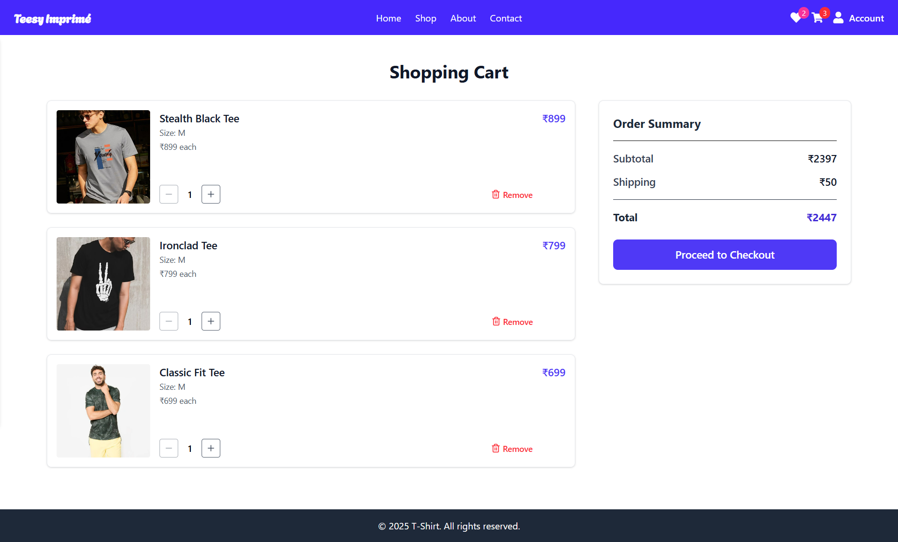
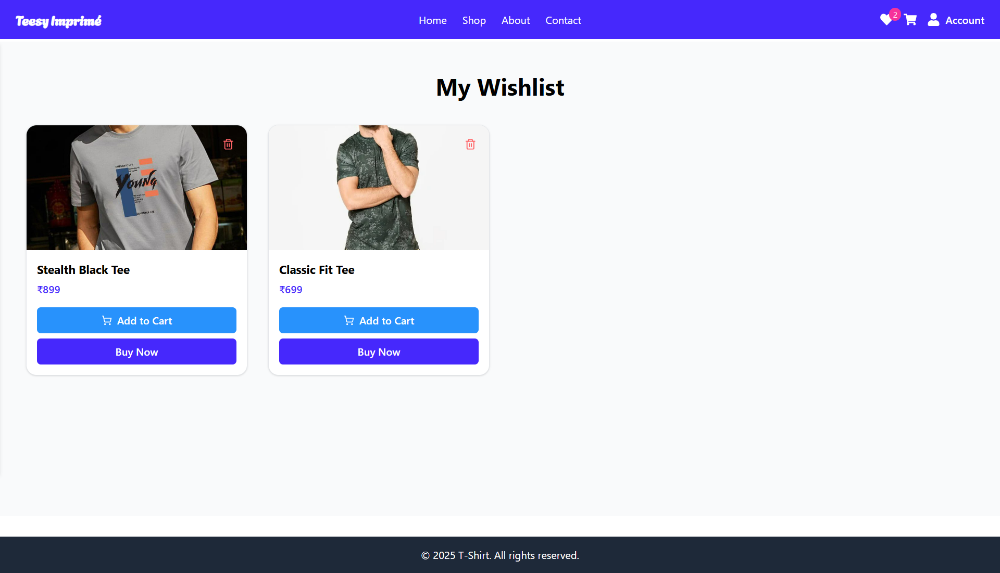
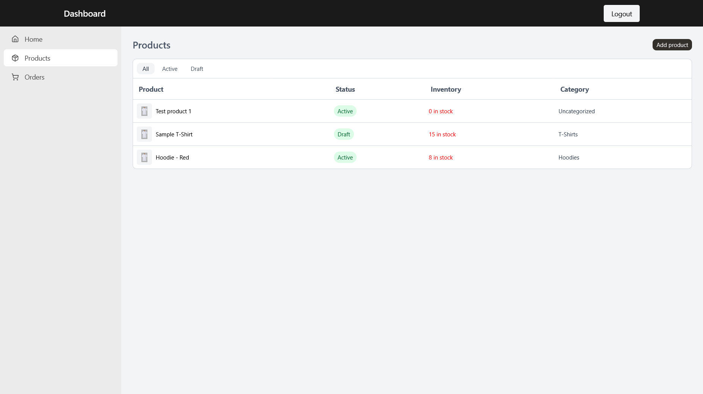
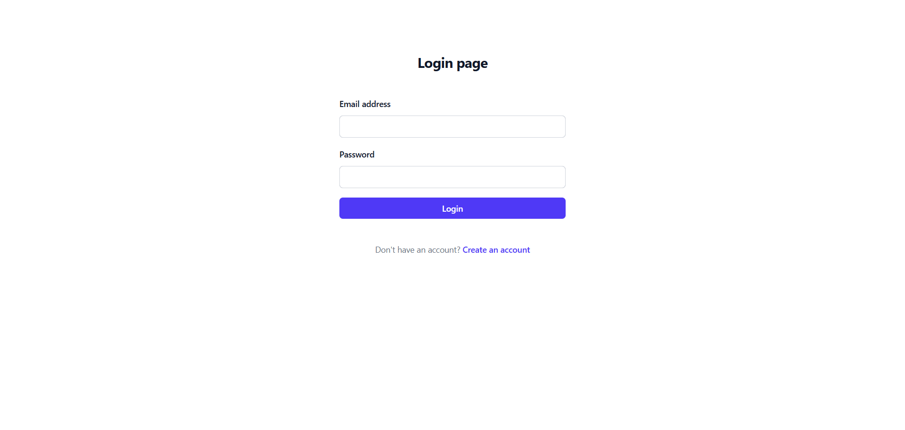
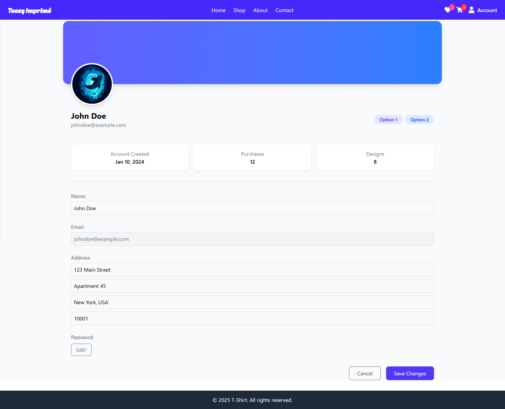
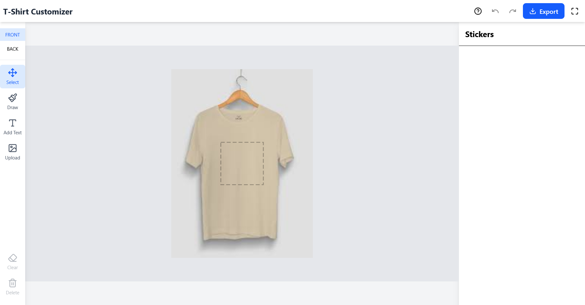
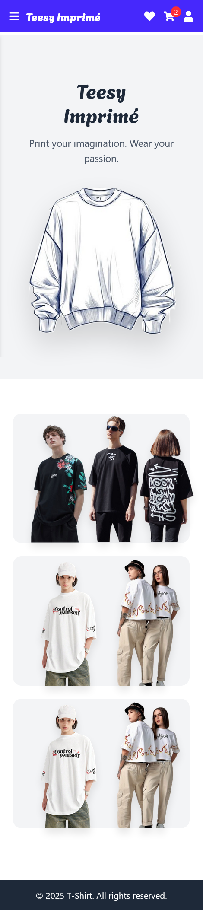
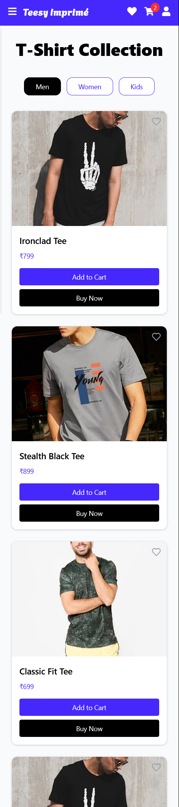

# Teesy Imprime - E-commerce Platform

Teesy Imprime is a full-stack MERN e-commerce platform for custom cloth printing, developed with a **React frontend** and **Node.js/Express backend**. This repository contains both the frontend and backend merged into a single repository with complete commit history.

---

## Project Structure
```
teesy-imprime-ecommerce/
│
├── backend/ # Express backend with API routes, models, controllers
│ ├── controllers/
│ ├── models/
│ ├── routes/
│ ├── utils/
│ ├── middlewares/
│ ├── package.json
│ └── ...
│
├── frontend/ # React frontend with pages, components, assets
│ ├── src/
│ ├── public/
│ ├── package.json
│ └── ...
│
└── README.md # Project documentation
```

---

## Features

### Backend
- User authentication (admin and client)
- Product and order management
- Cloudinary integration for image uploads
- Admin dashboard APIs
- Error handling and middleware support

### Frontend
- Dynamic product display and shopping cart
- User login/signup
- Admin panel for product and order management
- T-shirt customization using `react-konva`
- Responsive UI with React components

---
## Screenshots

### Home Page


### Product Page


<p align="center">
  
  
  
</p>

<p align="center">
  
</p>
<p align="center">
  
  
</p>

### Mobile

<p align="center">
  
  
</p>


---
## Acknowledgements

- React, Express, Node.js, MongoDB, Mongoose
- Cloudinary for image hosting
- react-konva for canvas-based T-shirt customization
- Inspiration from multiple e-commerce learning projects
- Special thanks to the **Zaalima project** for inspiration and foundational ideas.  
- Thanks to the open-source community for tools and libraries that made this project possible.  
- Shoutout to contributors and Team mates

---
